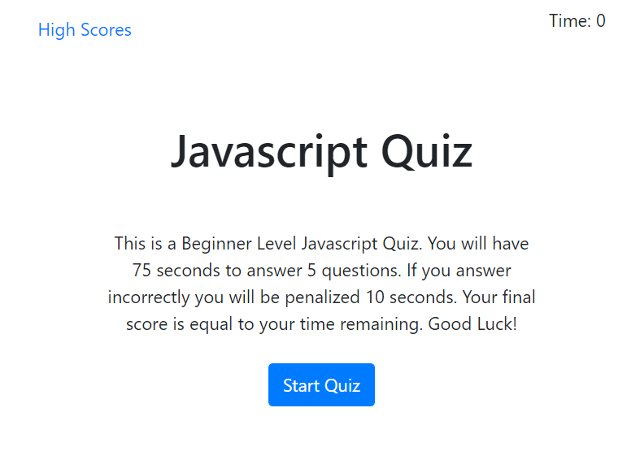

:part_alternation_mark:

# JS-Quiz-Dynamic

---
 

>Link to page https://mt2314.github.io/JS-Quiz-Dynamic/

## Job Requirements
---

 

>Build a Timed Multiple Choice Coding Quiz 

>Dynamically Updated HTML and CSS using Javascript

>Script includes Intervals, Local Storage, Dynamically Created Elements

  
 

| Job Requirements                               | Solutions                                                                                       |
| ---------------------------------------------- | ----------------------------------------------------------------------------------------------- |
| WHEN I click the start button                   | THEN a timer starts and I am presented with a question   :heavy_check_mark:                                                          |
| WHEN I answer a question | THEN I am presented with another question:heavy_check_mark: |
| WHEN I answer a question incorrectly                 | THEN time is subtracted from the clock:heavy_check_mark:                                                           |
| WHEN all questions are answered or the timer reaches 0             | THEN the game is over:heavy_check_mark:                                                              |
| WHEN the game is over                  | THEN I can save my initials and score:heavy_check_mark:                                                        |
| Extra:heavy_check_mark:               | Extra:heavy_check_mark:                                                              |
| When I submit Intials                 | Then I can view my score and previous quiz scores :heavy_check_mark:                                                        |
| When I click clear highscores               | Then the higscores are cleared:heavy_check_mark: 

 
 

## Credits
---
:school: 
**University of Toronto Continuing Educationg
Full Stack Flex Program** - *Initial HTML and CSS*
:school:

:heart: 
*Students and Instructors At the UFT-FSF-2020-2021*
:heart:

 

## License
---

All rights reserved.

Licensed under the MIT license.
 

 

:lock::lock::lock::lock:

_____
____
___